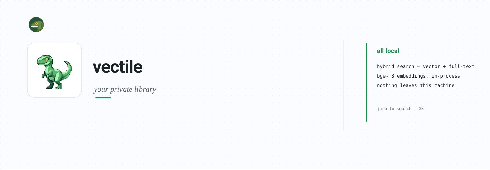
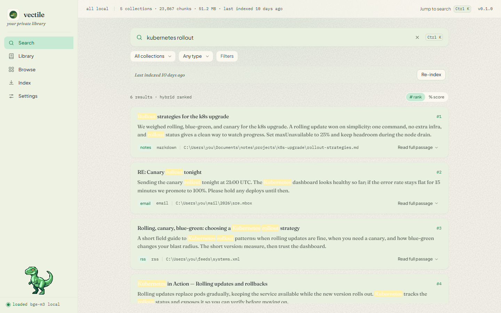
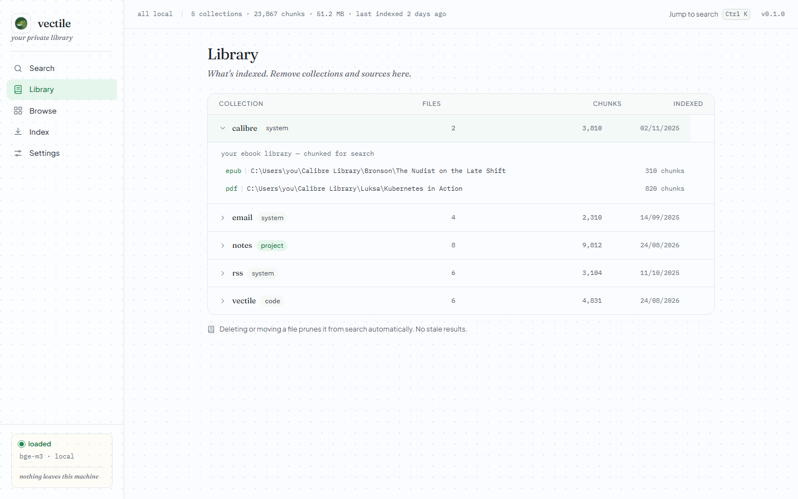
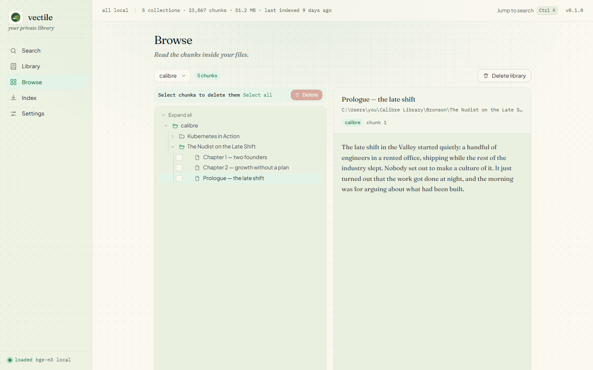
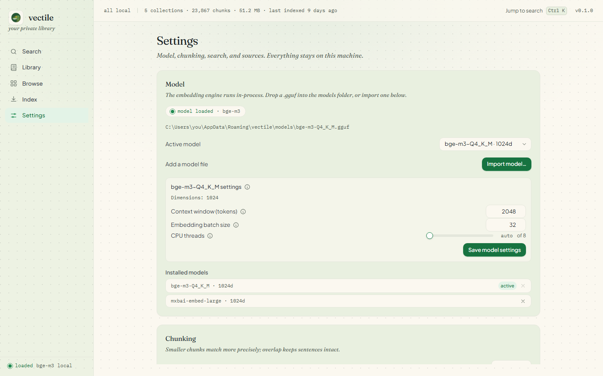

# vectile: your private library

A fully local, privacy-preserving RAG (Retrieval Augmented Generation) system for Windows, macOS, and Linux. It indexes personal knowledge from several sources into a single SQLite database with hybrid vector + full-text search, then lets you find things by meaning, not just by exact words, from a fast keyboard-first desktop app. Everything runs on your machine. No server, no cloud, no network calls.

Inspired by Sebastian Hutter’s local-rag. No Ollama, no API keys, no model downloads. The embedding model is a `.gguf` file you import once; after that it runs in-process.

<p align="center">
  
</p>

## Screenshots

Screenshots show sample data.

<p align="center">
  
</p>

<table>
  <tr>
    <td></td>
    <td></td>
    <td></td>
  </tr>
</table>

## Supported sources

| Source | Collection Type | What Gets Indexed |
|---|---|---|
| Obsidian | system | Vault files: `.md` notes with frontmatter, tags, and wikilinks |
| Project folders | project | Any folder of documents, each file parsed by its extension (`.md`, `.pdf`, `.docx`, `.html`, `.txt`, `.csv`, `.json`, `.yaml`, `.epub`) |
| Code repositories | code | Git repos: tree-sitter splits each function and class into its own chunk (cAST split-then-merge); commit history is indexed as its own source |
| Calibre | system | Ebook metadata + content: title, author, tags, series, publisher, description, and EPUB/PDF text |

## Installation

### From source

Prerequisites:

- Go 1.26+
- Node.js + npm
- the `wails3` CLI
- Windows only: MinGW-w64 on `PATH`, with `LIBRARY_PATH` and `C_INCLUDE_PATH` pointing at `third_party/llama-go` (the Windows build task sets these)

From the project root:

```
task dev          # run in development mode
task build        # build the binary to bin/
task package      # package an installer for the current OS
```

### Installing the model

The app never downloads an embedding model. Drop a `.gguf` file into the `models/` folder inside the app data directory, or import one from Settings (a native file dialog copies it into `models/`). The default model is bge-m3.

## Quick start

1. Launch vectile.
2. Import an embedding model in Settings, or drop a `.gguf` into `models/`.
3. Add sources in Settings: Obsidian vaults, project folders, code repositories, Calibre libraries.
4. Open the Index view and index a collection, or everything at once. Unchanged files are skipped, so re-indexing is fast.
5. Press ⌘K / Ctrl K and search.

## GUI

Five views, keyboard-first:

- **Search** (home): a large search bar, a filter row, and results as cards with title, snippet, score, collection, and source path. Jump in from anywhere with ⌘K / Ctrl K.
- **Library**: every collection with its sources and chunk counts; expand one to list its files.
- **Browse**: a file tree of collections, files, and chunks, with a preview pane.
- **Index**: trigger indexing per collection or all at once, with progress.
- **Settings**: sources, model, chunking, search defaults, auto-reindex, and start-on-login.

The sidebar shows the model state: idle, loaded, or failed. If the model file is missing or corrupt, vector search falls back to full-text search, so exact-word matches still work.

Files you delete get pruned automatically, so results don't go stale. Auto-reindex, if enabled, re-indexes everything on a timer. Start-on-login launches the app with your session.

## How search works

A query runs two searches at once.

- Full-text search matches the exact words against an FTS5 index. Fast, precise, literal.
- Vector search embeds the query and finds stored vectors that point the same way. That's how a query like "how do we ship changes safely" can match a note about blue-green deploys that never uses those words.

The vector path is two-stage: a cheap binary-quantized index finds a pool of candidates, then the exact float vectors are fetched and reranked by distance. The two result lists are merged with Reciprocal Rank Fusion, which blends ranks rather than scores.

Filters narrow results: collection, source type, path substring, sender or author, and date range. Top-k controls how many results come back.

## Configuration

Config file: `<os.UserConfigDir()>/vectile/config.json`

| Key | Default | Description |
|---|---|---|
| embedding_model | bge-m3 | Embedding model name |
| active_model | (default model path) | Path to the active `.gguf` model |
| embedding_batch_size | 32 | Chunks per embedding call |
| chunk_size_tokens | 500 | Chunk size in whitespace-separated words |
| chunk_overlap_tokens | 50 | Overlap between chunks |
| obsidian_vaults | [] | Paths to Obsidian vaults |
| obsidian_exclude_folders | [] | Folders to skip in vaults |
| calibre_libraries | [] | Paths to Calibre libraries |
| repositories | {} | Map of collection name to repo or directory paths; directories are scanned recursively for git repos |
| projects | {} | Map of collection name to document paths |
| disabled_collections | [] | Collection names to skip during indexing |
| skip_cloud_placeholders | true | Skip cloud-only placeholder files (OneDrive, iCloud, Google, Synology) instead of downloading them |
| git_history_in_months | 6 | How far back to index commit history |
| git_commit_subject_blacklist | [] | Skip commits whose subject starts with any of these strings |
| search_defaults.top_k | 10 | Default number of search results |
| search_defaults.rrf_k | 60 | Reciprocal Rank Fusion parameter |
| search_defaults.vector_weight | 0.7 | Weight for vector similarity |
| search_defaults.fts_weight | 0.3 | Weight for full-text search |
| gui.auto_reindex | false | Enable periodic re-indexing |
| gui.auto_reindex_interval_minutes | 60 | Minutes between auto-reindex runs |
| gui.start_on_login | false | Launch at login |

## Tech stack

| Component | Choice | Notes |
|---|---|---|
| Language | Go 1.26+ | Wails v3 desktop app |
| UI | SolidJS + TypeScript + Vite | Tailwind CSS v4 |
| Database | SQLite (modernc.org/sqlite) + sqlite-vec + FTS5 | Pure Go, no cgo; single file |
| Embeddings | llama.go (llama.cpp) | In-process `.gguf`; bge-m3 by default; no Ollama |
| Code parsing | go-tree-sitter | Structural splitting (functions, classes, methods) with the cAST split-then-merge strategy |
| PDF | go-pdfium (WASM/Wazero) | No cgo needed |
| DOCX | archive/zip + encoding/xml | Word document extraction (.docx, .dotx) |

## Building and developing

```
task dev        # run in development mode
task build      # build the binary to bin/
task package    # package an installer for the current OS
```

Tests: `go test ./backend/...`. Model-dependent tests skip when the model is not in `models/`.

On Windows the built exe needs five MinGW runtime DLLs beside it (libgcc_s_seh-1.dll, libgomp-1.dll, libstdc++-6.dll, libwinpthread-1.dll, libdl.dll). Missing libdl.dll causes a silent 0xC0000135 exit at launch.

## Architecture

```
main.go                     app startup, window, services, auto-reindex loop
backend/appdata             the data directory and the model path
backend/config              config.json load, save, defaults
backend/db                  SQLite schema and helpers (modernc + vec0 + FTS5)
backend/embeddings          the llama.go embedder (bge-m3)
backend/chunker             word-window and markdown chunking
backend/parser              file parsers: md, docx, html, epub, pdf, calibre, code
backend/search              hybrid search: vector + FTS + RRF
backend/indexer             obsidian, project, git, calibre indexers; prune
backend/services            Wails services the UI calls
backend/startup             launch-at-login per OS
third_party/llama-go        vendored llama.cpp bindings
frontend/src/lib/api.ts     the only place the UI touches the bindings
```

## License

MIT License, copyright (c) 2026 d3uceY.
